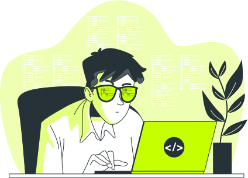
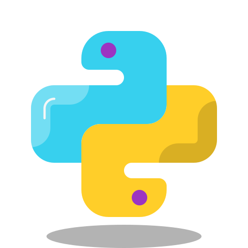
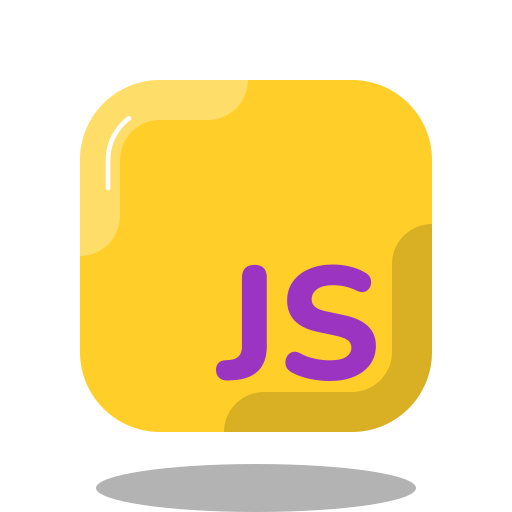
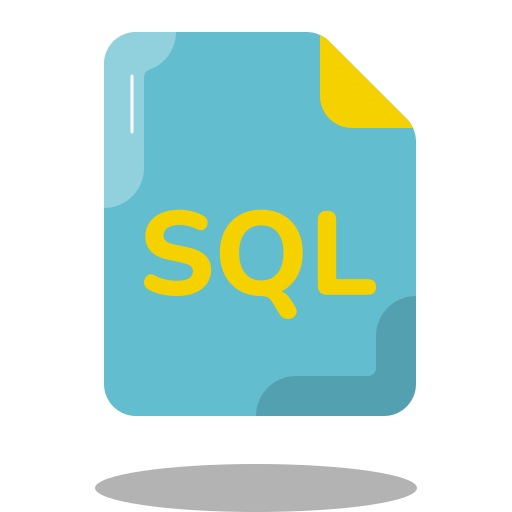
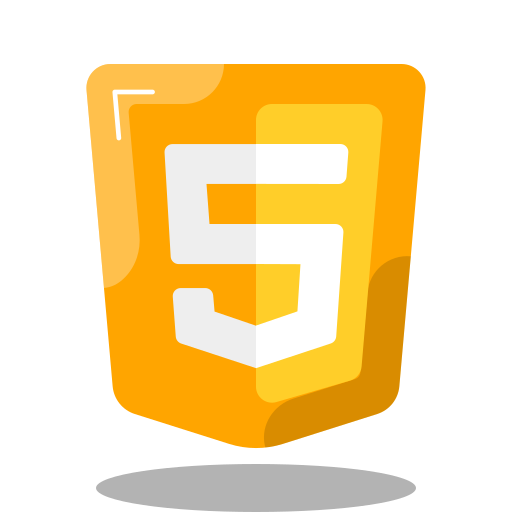
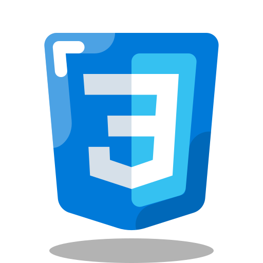
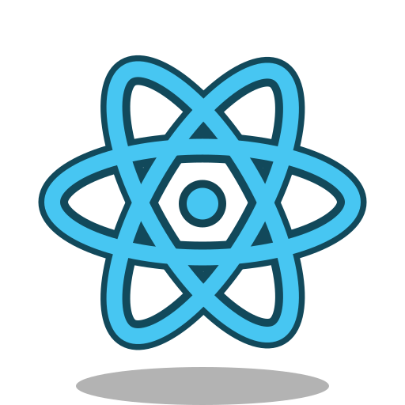
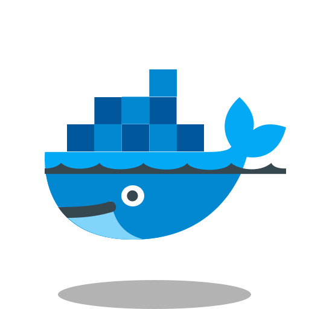
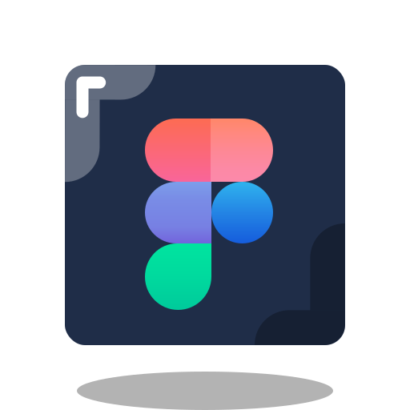

<h1>Hello there! I'm Roman</h1>
<h3>Python Developer</h3>

<h2>About me</h2>
My name is Roman, and I am 14 years old. I am proud to say that I am a Python developer. My introduction to the world of programming started at the age of 11, when I felt a wave of inspiration and desire to create something new. Today I am developing bots for Telegram and Discord, as well as creating unique websites. Every project for me is not just a job, but an opportunity to express my ideas and bring them to life, making the world of technology more interesting and accessible.
 
<h2>Languages and tools</h2>

 

          
<h2>My state</h2>
  
 

<h2>My Projects</h2>

