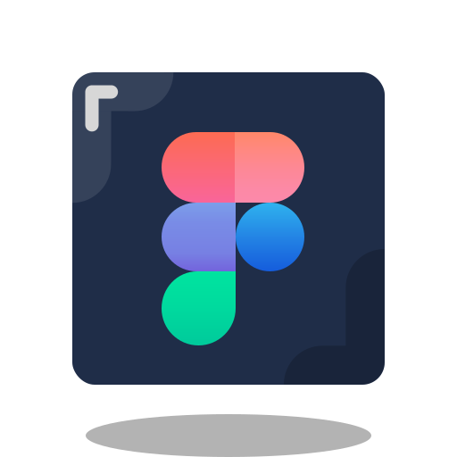

 
<h2 href="https://github.com/MrEnderman-YT"></h2>

<h2>📋 About me</h2>
⠀

My name is Roman, and I am 14 years old. I am proud to say that I am a Python developer.
My introduction to the world of programming started at the age of 11, when I felt a wave of inspiration and desire to create something new.  
Now I am developing bots for Telegram and Discord, as well as creating unique websites. Every project for me is not just a job, but an opportunity to express my ideas and bring them to life, making the world of technology more interesting and accessible.

> **“I'm not a great programmer, I'm just a good programmer with great habits.” - Kent Beck**

⠀
<h2><b>💼 My stack</b></h2>
<h3>● Languages</h3>

<h3>● Frameworks/Libraries</h3>

<h3>● Software</h3>

⠀
<h2>⭐ My state</h2>
  
 

⠀
<h2>📌 Pinned</h2>

